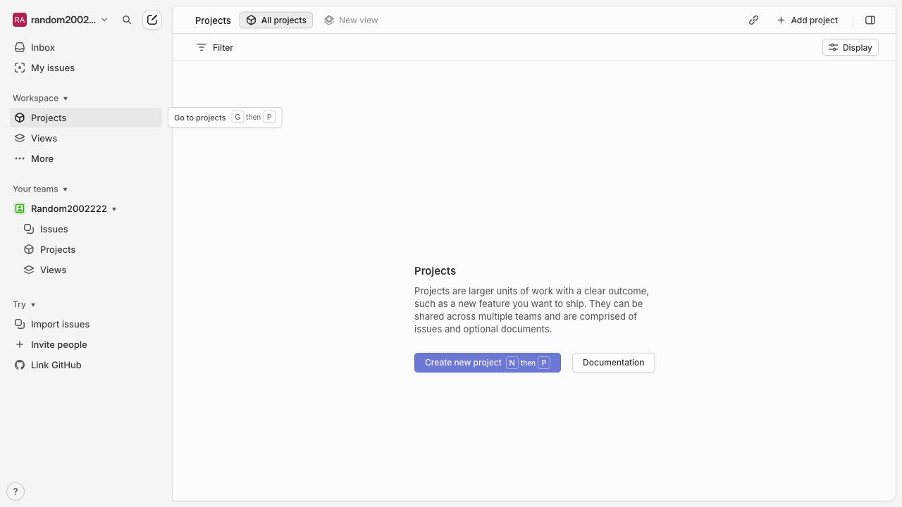
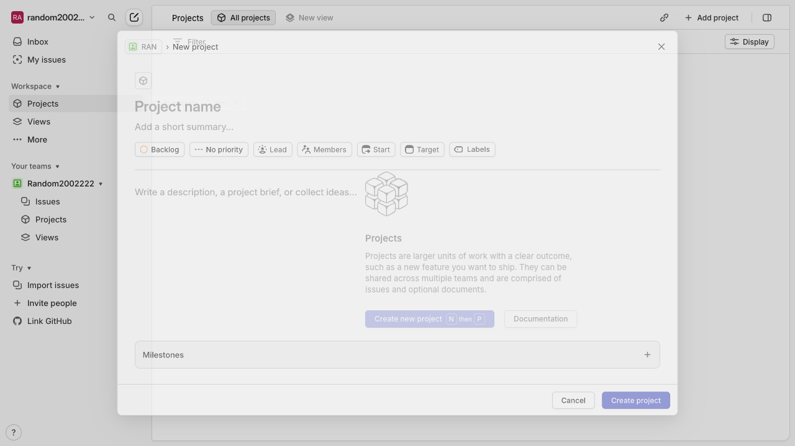
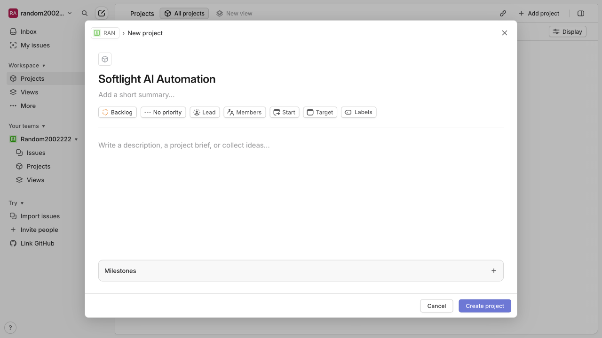
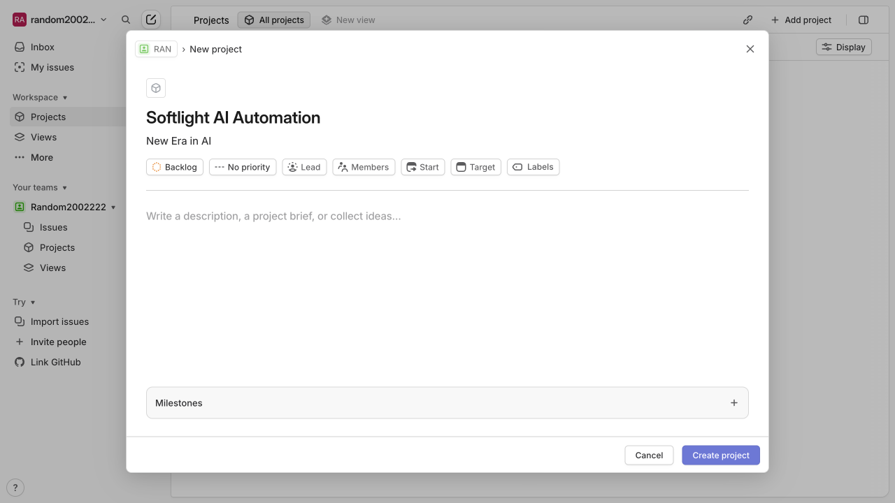
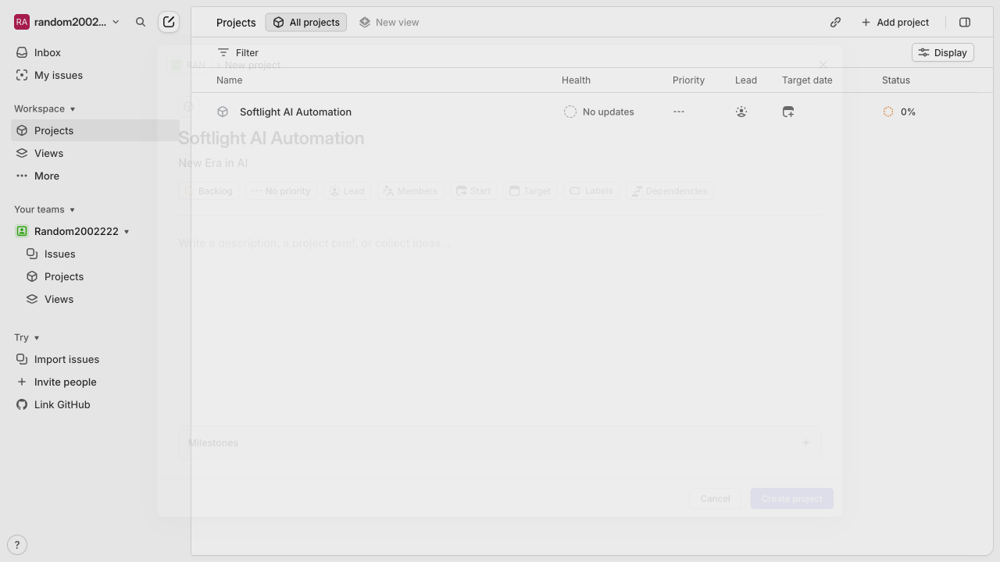
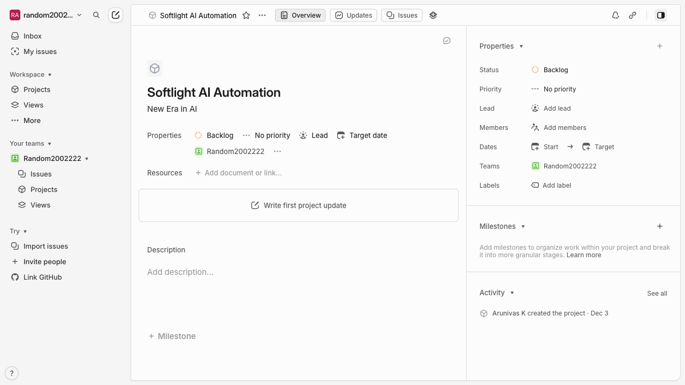

# How do I Create a new project named ‘Softlight AI Automation’ with summary ’New Era in AI’ in Linear?

**Application:** Linear
**URL:** about:blank
**Generated:** 2025-12-03 12:14:08

## Summary

Successfully demonstrated: How do I Create a new project named ‘Softlight AI Automation’ with summary ’New Era in AI’ in Linear?

---

## Step 1: Navigate to https://linear.app/

---

## Step 2: Click on 'Projects'

---

## Step 3: Click on 'Create new project'

---

## Step 4: Type in the 'Project name' field

---

## Step 5: Type in the 'Project summary' field

---

## Step 6: Click on 'Set project lead'

---

## Step 7: Click on element 73

---

## Step 8: Task completed

---

✅ **Task completed successfully!**
