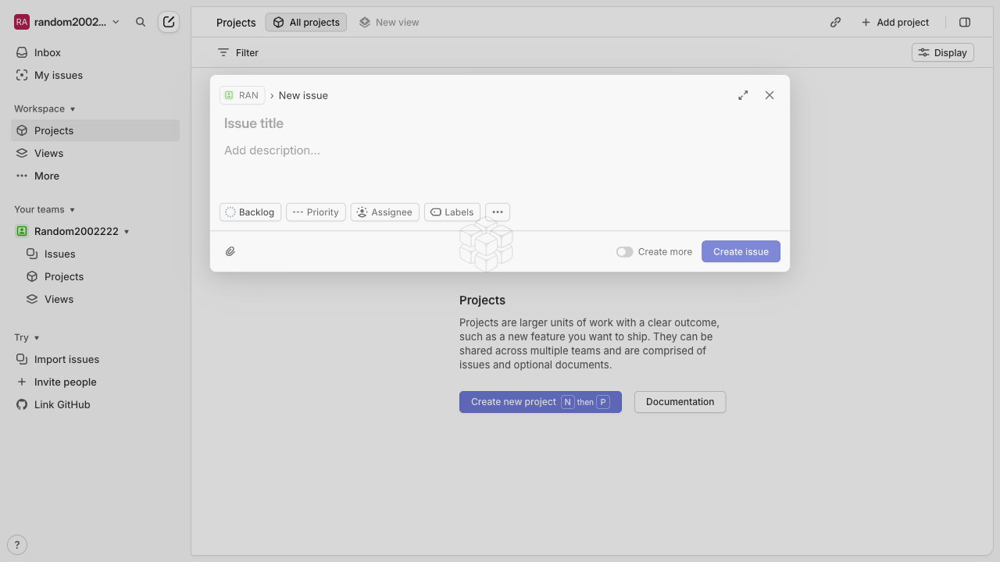
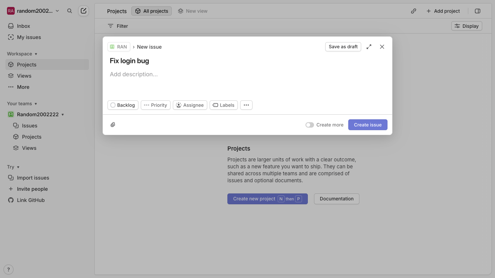
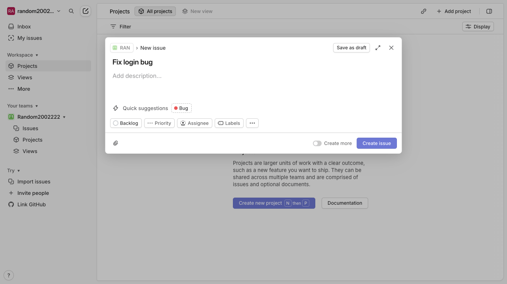
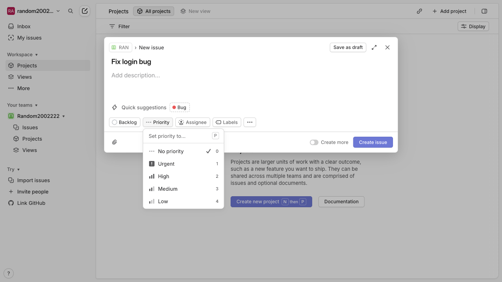
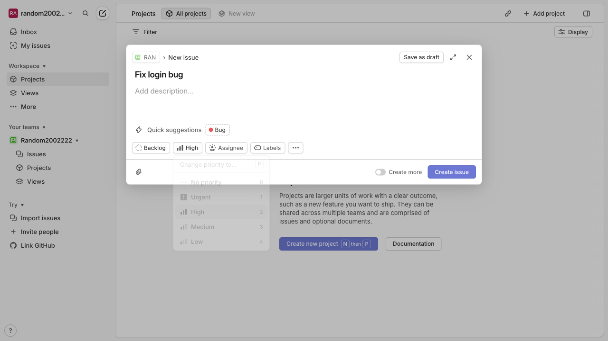
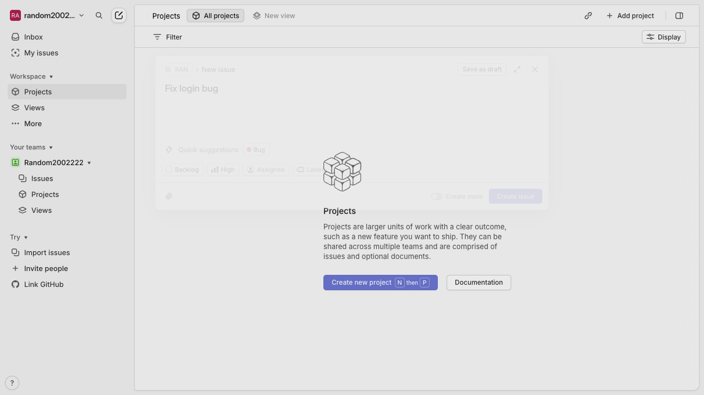
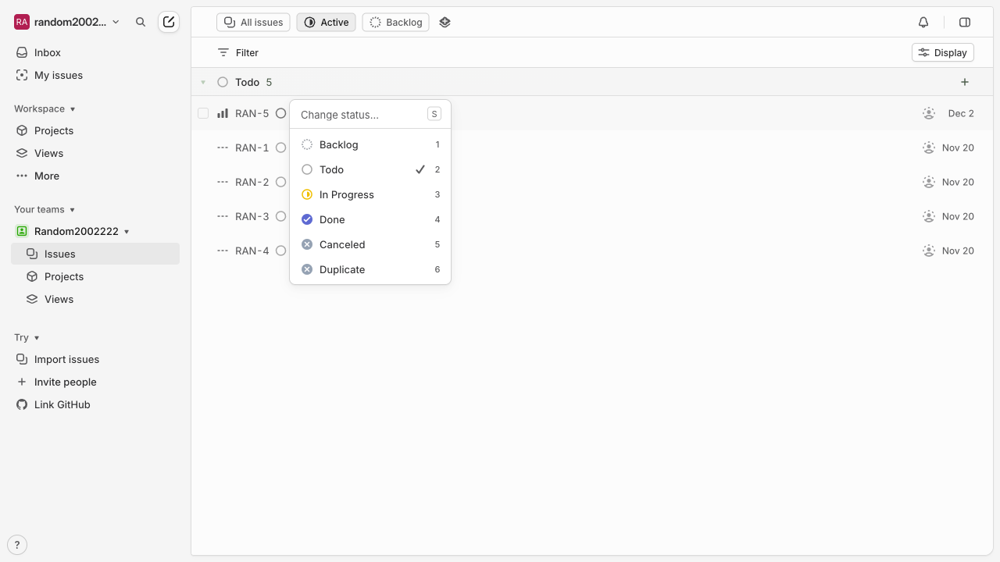

# 2. How can I Create a new issue titled 'Fix login bug' with priority High in Linear?

**Application:** Linear
**URL:** about:blank
**Generated:** 2025-12-02 14:30:01

## Summary

Successfully demonstrated: 2. How can I Create a new issue titled 'Fix login bug' with priority High in Linear?

---

## Step 1: Click on 'Create new issue'

---

## Step 2: Type in the 'Set team' field

---

## Step 3: Click on 'Apply suggested "Bug" label'

---

## Step 4: Click on 'Change priority. No priority is selected'

---

## Step 5: Click on 'High
2'

---

## Step 6: Click on element 58

---

## Step 7: Click on element 57

---

## Step 8: Task completed

---

✅ **Task completed successfully!**
