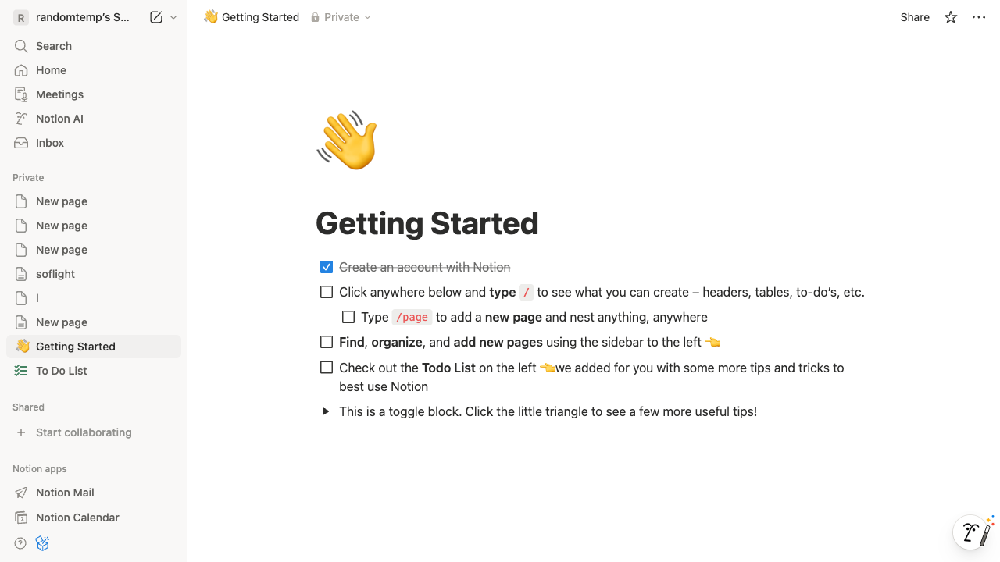
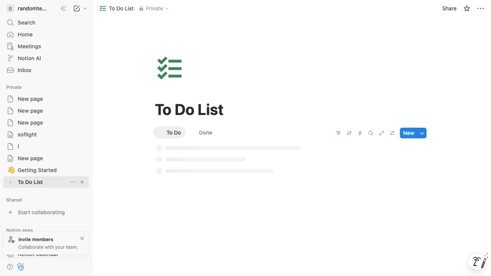
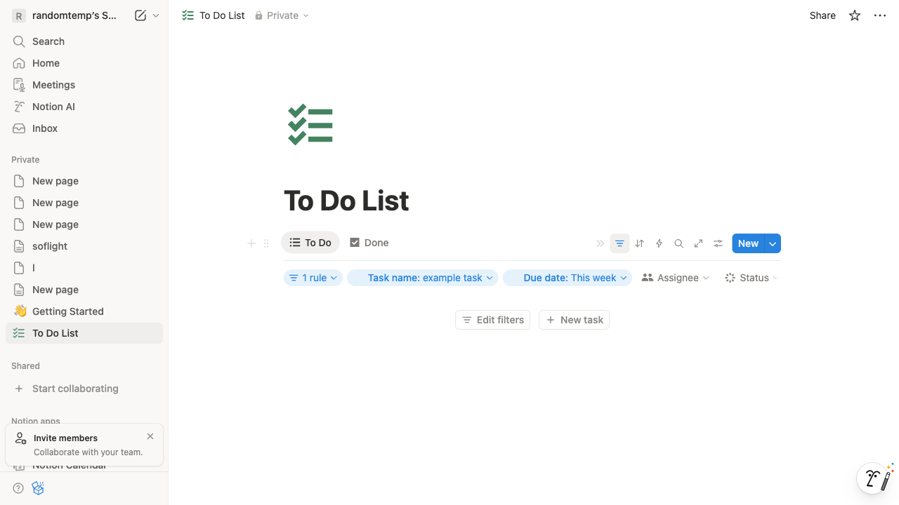
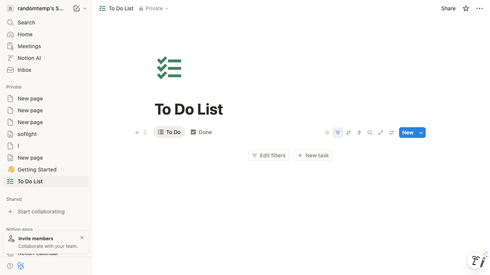
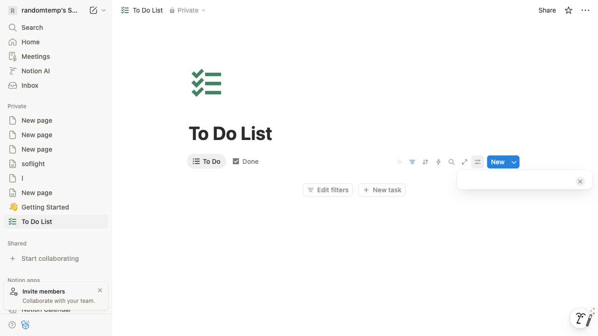
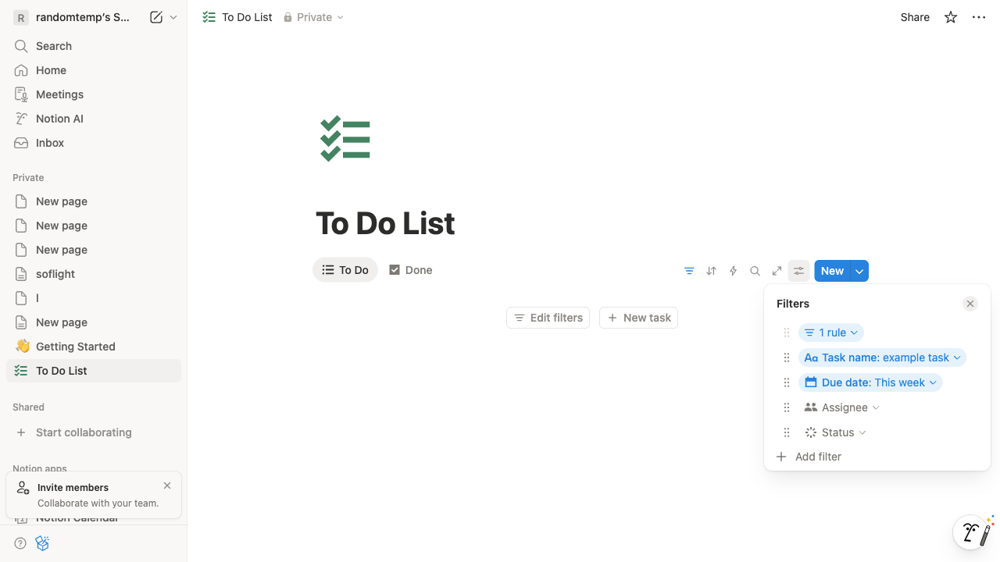
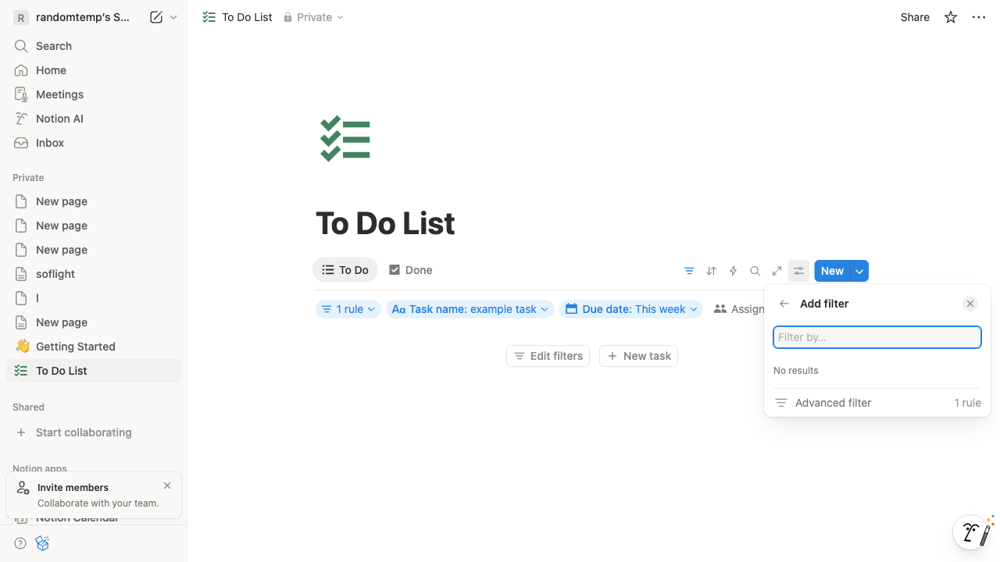
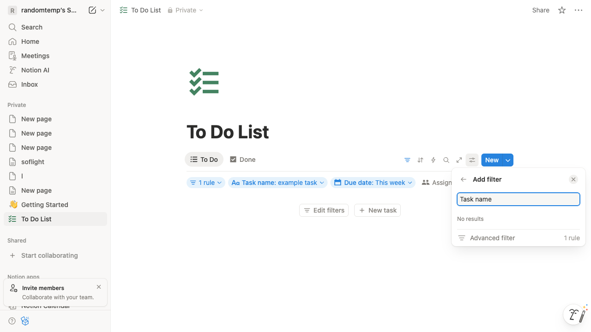
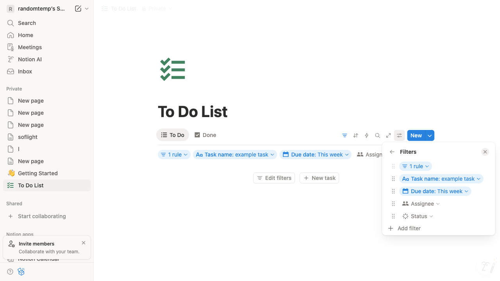
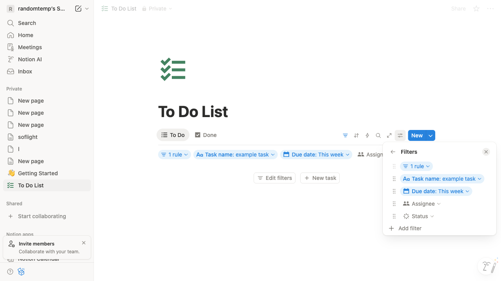

# How do I filter a database in Notion?

**Application:** Notion
**URL:** about:blank
**Generated:** 2025-12-02 14:31:09

## Summary

Successfully demonstrated: How do I filter a database in Notion?

---

## Step 1: Navigate to https://www.notion.so/?cookie_sync_completed=true

---

## Step 2: Click on 'Add a page inside'

---

## Step 3: Click on 'Done'

---

## Step 4: Click on 'Filter'

---

## Step 5: Click on ' '

---

## Step 6: Click on element 93

---

## Step 7: Click on 'div element'

---

## Step 8: Type in the 'Filter by…' field

---

## Step 9: Click on 'Task name: example task'

---

## Step 10: Task completed

---

✅ **Task completed successfully!**
